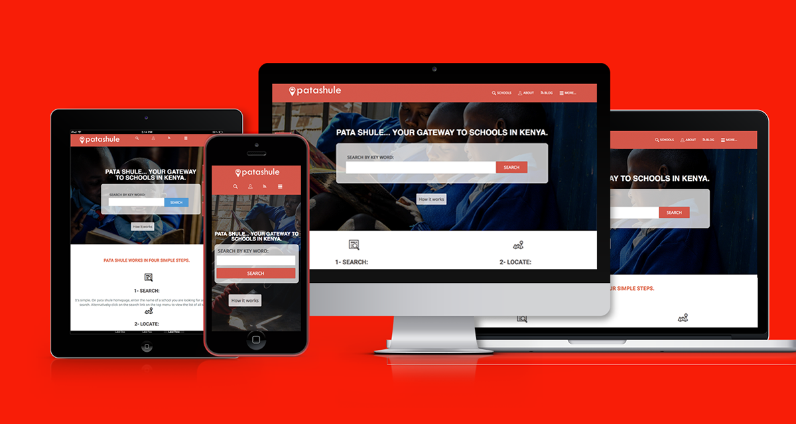

# Html-Css-Capstone-project

# List of Schools - Capstone Project
 
> A real life project after completing HTML-CSS course completion.

## Built With

- HTML5
- GRID
- FLEX
- Media Query
- CSS3
-Bootstrap

## Live Demo

To see a preview of the actual project, check out the [Live Demo Link](https://raw.githack.com/karthykarthick/Html-Css-Capstone-project/development/index.html)

## Video Presentation of the project
[Video Presentation Link] (https://www.loom.com/share/f4a9f29663a846ff92c24c48f1c36a30)

## Getting Started

To get a local copy up and running follow these simple example steps.

### Prerequisites
To run the project smoothly, you must have the following installed on your machine:

- Git
- A web browser.

### Setup
You need to clone the project by running `git clone https://github.com/karthykarthick/Html-Css-Capstone-project.git` You'd then navigate to the location to which you cloned the project and run the `index.html` file on your browser.

## Authors

👤 **Karthick**

- Github: [@karthykarthick](https://github.com/karthykarthick)
- Linkedin: [karthick harimoorthy](https://www.linkedin.com/in/karthick-harimoorthy/)

## 🤝 Contributing

Contributions, issues and feature requests are welcome! Start by:

- Forking the project
- Cloning the project to your local machine
- `cd` into the project directory
- Run `git checkout -b your-branch-name`
- Make your contributions
- Push your branch up to your forked repository
- Open a Pull Request with a detailed description to the development branch of the original project for a review

## Show your support

Give a ⭐️ if you like this project!

## Acknowledgments

- Project originally taken from The Odin Project
- Project inspired by Microverse Program
- Thanks for this UX/UI Design 
  [Mathew Njuguna - PATASHULE](https://www.behance.net/gallery/25563385/PatashuleKE).
- CSS Tricks

## 📝 License

This project is [MIT](LICENSE) licensed.
